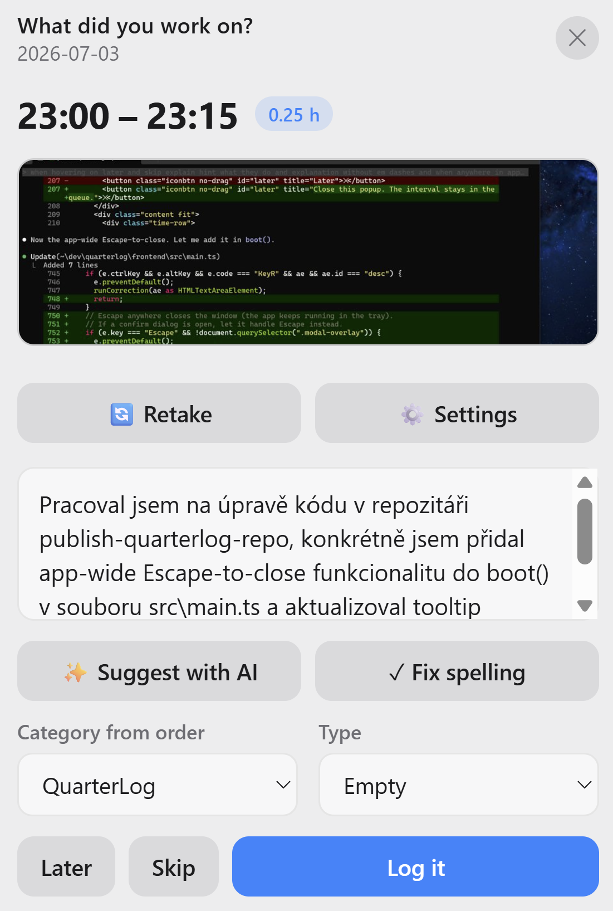
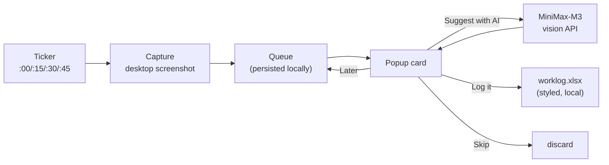

<div align="center">

# ⏱️ Quarterlog




</div>

---

Quarterlog is a minimal Windows **system-tray app** that helps you keep an honest
timesheet without breaking your flow. Every 15 minutes it quietly takes a screenshot
of your desktop and pops up a small, macOS-style card. You let the **MiniMax-M3**
vision model draft one sentence describing what you were doing (you review and edit it),
pick a category and type, and it appends a row to a **local, nicely styled Excel file**.

No cloud service, no SharePoint, no account — the worklog is just an `.xlsx` on your disk.

---

## ⚠️ Privacy: read this before you enable AI

> **Using "Suggest with AI" uploads a screenshot of your desktop to a third-party AI
> provider (MiniMax).**

That screenshot can contain **anything that was on your screen** for that quarter hour:
customer data, passwords in a terminal, private messages, source code under NDA,
medical or legal documents, an email you shouldn't be forwarding to anyone — let alone
to an external AI service in another jurisdiction.

**This is the single most important thing to understand about Quarterlog.** The app is
built to make it *hard to leak something by accident*, but the responsibility is yours.
There are three layers of protection, from lightest to strongest:

| If you… | Use… | What leaves your machine |
|---|---|---|
| type the description yourself | just don't press *Suggest with AI* | **nothing** |
| have one sensitive window on an otherwise-fine screen | **🔄 Retake** | a *new* screenshot after you cover the sensitive part |
| are doing sensitive work for a while | **🔒 Confidentiality regime** | **nothing — images can't be sent at all** |

### 🔒 The Confidentiality Regime

Toggle it any time — **even when the app isn't focused** — with the global
**`Ctrl + Alt + C`** hotkey (or in **Settings → Privacy**). A fading toast confirms the
new state on screen. While it is ON:

- **No screenshot is ever sent to the AI — full stop.** *Suggest with AI* is disabled,
  and the block is enforced in the backend too, not just hidden in the UI. Even if
  something tried to call the vision API, it is refused.
- **You write the description yourself.** That's the point — nothing about your screen
  is inferred by a remote model.
- **The only AI feature that still works is the text-only spelling/diacritics fix** —
  and even that stops to ask you with a clear **Yes / No** dialog before sending, because
  it transmits *the words you typed* (never an image) to the provider. Choosing
  **“No, keep it private”** cancels and nothing is sent. If that text is itself
  sensitive, say no.

Turn it on before you start confidential work and leave it on; a small **🔒 Confidential**
badge appears on the popup so you always know the regime is active.

### 🔄 Retake — for one-off sensitive windows

If most of your screen is fine but one window isn't, press **🔄 Retake**. The app hides
itself, counts down so you can drag another window over the sensitive content, then
re-shoots — so the screenshot you send never contained the private part in the first place.

> **Bottom line:** if you would not paste it into a public chatbot, do not press *Suggest
> with AI*. Turn on the Confidentiality Regime and type it yourself.

---

## ✨ Features

- **Automatic quarter-hour prompts** — a wall-clock-aligned ticker fires at `:00/:15/:30/:45`.
- **AI-drafted descriptions** — the desktop screenshot is sent to MiniMax-M3, which
  returns a concise, first-person sentence *and* classifies the work Type. You always
  review and edit before anything is saved.
- **Privacy-first** — nothing leaves your machine unless you press *Suggest with AI*.
  See [Privacy](#️-privacy-read-this-before-you-enable-ai) — it matters.
- **🔒 Confidentiality regime** (global `Ctrl + Alt + C`) — a hard mode that blocks *all* image/vision
  calls; you type descriptions yourself and only the text-only spelling fix works
  (with a confirmation). Enforced in the backend, not just the UI.
- **🔄 Retake screenshot** — cover up anything confidential and re-shoot (the app hides
  itself during the countdown so the popup isn't in the shot).
- **Spelling & diacritics fix** — one click (or `Ctrl+Alt+R`) cleans up Czech/English text.
- **Never lose an interval** — miss a popup and it queues up; review pending intervals
  in a batch later. *Skip* anything that wasn't work.
- **Styled local Excel output** — bold header, frozen row, autofilter, borders, proper
  date/number formats. Columns: *Day, Hours, Category from order, Description, Type, Month*.
- **Configurable popup position** — a 3×3 picker places the card in any screen zone
  (DPI-aware, so it lands correctly on scaled displays).
- **Polished, translucent UI** — frameless acrylic window, light/dark aware.

## 🖥️ The main screen


Every control on the interval popup:

| Element | What it does |
|---|---|
| **Time range + hours pill** | The interval being logged (e.g. `16:45 – 17:00`, `0.25 h`). |
| **Screenshot preview** | The desktop capture for this interval. |
| **🔄 Retake** | Hides the window, counts down so you can cover confidential content, then re-shoots. |
| **⚙️ Settings** | Opens the settings screen. |
| **Description box** | What you did. Type it yourself, or let AI fill it in. |
| **✨ Suggest with AI** | Sends the screenshot to MiniMax-M3 → editable draft + auto-picked Type. |
| **✓ Fix spelling** | Fixes spelling & diacritics via AI (or press `Ctrl+Alt+R`). |
| **Category from order / Type** | Dropdowns populated from Settings; Type is pre-selected by the AI. |
| **Later** | Keep the interval in the queue for later. |
| **Skip** | Discard the interval (nothing to log). |
| **Log it** | Append the row to the Excel worklog. |

## 🔧 How it works



Screenshots are held locally in a queue until you log or skip them, so a missed popup
(or a laptop that went to sleep) never means a lost interval.

## ⬇️ Download

Grab the latest **`quarterlog.exe`** from the
[**Releases page**](https://github.com/NovakDavid98/QuarterLog/releases/latest) and run
it. No installer: it drops straight into your system tray (blue **Q**, possibly under
the `^` overflow arrow). Requires Windows 10/11 with the WebView2 runtime.

On first run, open **Settings** from the tray and paste your MiniMax API key, set your
Categories/Types and the worklog file path.

> Windows SmartScreen may warn that the binary is unsigned. It's built by GitHub Actions
> directly from this repo, so you can inspect the build log for any release tag.

Prefer to build it yourself? See below.

## 📦 Prerequisites

- **Windows 10/11**
- **WebView2 runtime** (already present on modern Windows)
- **Go 1.26+**, **Node 18+**, and the **Wails v2 CLI**

See [docs/BUILD.md](docs/BUILD.md) for exact setup.

## 🚀 Build & run

```powershell
# install the Wails CLI once
go install github.com/wailsapp/wails/v2/cmd/wails@latest

git clone https://github.com/NovakDavid98/QuarterLog.git
cd QuarterLog

wails dev     # hot-reload development
wails build   # produces build\bin\quarterlog.exe
```

The app starts in the system tray. Right-click the tray icon for **Log now**,
**Review queue**, **Pause capturing**, **Settings…**, and **Quit**.

## ⚙️ Configuration

All settings live in the in-app **Settings** screen and are stored at
`%APPDATA%\Quarterlog\config.json`. Screenshots + the pending queue live in
`%LOCALAPPDATA%\Quarterlog\queue`.

| Setting | Notes |
|---|---|
| MiniMax API key | Bearer token for the vision API |
| MiniMax base URL | default `https://api.minimax.io/v1` |
| MiniMax model | default `MiniMax-M3` |
| Worklog file path | local `.xlsx`; default `Documents\Quarterlog\worklog.xlsx` |
| Categories / Types | dropdown options, one value per line |
| Interval (minutes) | default 15 |
| Monitor | primary / all-stitched / specific display |
| Popup position | 3×3 screen-zone picker |
| Description language | e.g. `Czech` |
| AI guidance prompt | tunes the drafted sentence |
| Launch at startup | adds an `HKCU\…\Run` entry |

Full reference: [docs/CONFIGURATION.md](docs/CONFIGURATION.md).

### MiniMax setup

Quarterlog uses MiniMax's **OpenAI-compatible** endpoint
(`POST {baseURL}/chat/completions`) with the vision-capable **`MiniMax-M3`** model.
Because M3 is a reasoning model, the app sends `"thinking": {"type": "disabled"}` so
you get a clean sentence instead of a `<think>` block. Paste your API key in Settings.

## ⌨️ Shortcuts

- **`Ctrl + Alt + R`** (in the description box) — fix spelling & diacritics with AI.
- **`Ctrl + Alt + C`** — toggle the 🔒 Confidentiality Regime on/off. This one is a
  **global** hotkey: it works from any app, and shows a fading on-screen toast.

## 🗂️ Project structure

```
quarterlog/
├── main.go                 # Wails bootstrap, system tray, single-instance guard
├── app.go                  # bound methods (capture, describe, submit, settings, popup positioning)
├── internal/
│   ├── config/             # settings load/save (%APPDATA%\Quarterlog\config.json)
│   ├── queue/              # persistent pending-interval queue
│   ├── capture/            # screenshot + downscaled JPEG/thumbnail encoding
│   ├── ticker/             # wall-clock-aligned ticker with sleep catch-up
│   ├── minimax/            # MiniMax-M3 vision + text client
│   ├── xlsxlog/            # styled Excel appender (excelize)
│   └── winutil/            # lock detection, single-instance mutex, autostart, work area
├── frontend/               # Wails frontend (vanilla TS + Vite)
│   └── src/{main.ts,style.css}
└── docs/                   # architecture, configuration, build guides
```

Architecture deep-dive: [docs/ARCHITECTURE.md](docs/ARCHITECTURE.md).

## 🧰 Tech stack

- **[Wails v2](https://wails.io)** — Go backend + web frontend, native WebView2 window
- **Go** — [`kbinani/screenshot`](https://github.com/kbinani/screenshot) (capture),
  [`energye/systray`](https://github.com/energye/systray) (tray),
  [`xuri/excelize`](https://github.com/xuri/excelize) (Excel), `golang.org/x/sys` (Win32)
- **Frontend** — vanilla TypeScript + Vite, hand-written macOS-style CSS
- **AI** — MiniMax-M3 vision model

## 🗺️ Roadmap

- Encrypt the API key at rest (Windows DPAPI)
- Optional one-sheet-per-month workbook layout
- Better multi-monitor handling for the popup position

## 📄 License

[MIT](LICENSE) © 2026 David Novák
