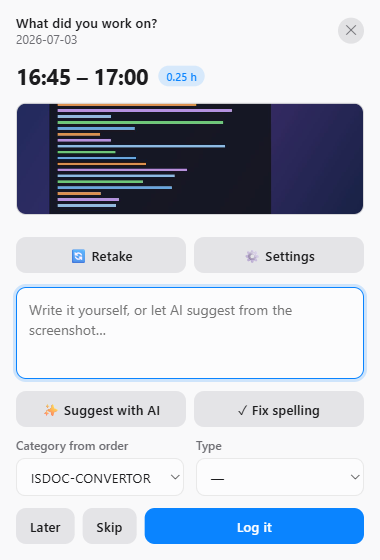
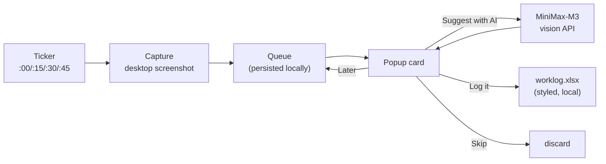

<div align="center">

# ⏱️ Quarterlog

**Log your work in quarter-hour increments — drafted by AI from a desktop screenshot, saved to a local Excel file.**




</div>

---

Quarterlog is a minimal Windows **system-tray app** that helps you keep an honest
timesheet without breaking your flow. Every 15 minutes it quietly takes a screenshot
of your desktop and pops up a small, macOS-style card. You let the **MiniMax-M3**
vision model draft one sentence describing what you were doing (you review and edit it),
pick a category and type, and it appends a row to a **local, nicely styled Excel file**.

No cloud service, no SharePoint, no account — the worklog is just an `.xlsx` on your disk.

## ✨ Features

- **Automatic quarter-hour prompts** — a wall-clock-aligned ticker fires at `:00/:15/:30/:45`.
- **AI-drafted descriptions** — the desktop screenshot is sent to MiniMax-M3, which
  returns a concise, first-person sentence *and* classifies the work Type. You always
  review and edit before anything is saved.
- **Privacy-first** — nothing leaves your machine unless you press *Suggest with AI*.
  If you type the description yourself, no screenshot is ever sent.
- **Retake screenshot** — cover up anything confidential and re-shoot (the app hides
  itself during the countdown so the popup isn't in the shot).
- **Spelling & diacritics fix** — one click (or `Shift+R`) cleans up Czech/English text.
- **Never lose an interval** — miss a popup and it queues up; review pending intervals
  in a batch later. *Skip* anything that wasn't work.
- **Styled local Excel output** — bold header, frozen row, autofilter, borders, proper
  date/number formats. Columns: *Day, Hours, Category from order, Description, Type, Month*.
- **Configurable popup position** — a 3×3 picker places the card in any screen zone
  (DPI-aware, so it lands correctly on scaled displays).
- **Polished, translucent UI** — frameless acrylic window, light/dark aware.

## 🖥️ The main screen


Every control on the interval popup:

| Element | What it does |
|---|---|
| **Time range + hours pill** | The interval being logged (e.g. `16:45 – 17:00`, `0.25 h`). |
| **Screenshot preview** | The desktop capture for this interval. |
| **🔄 Retake** | Hides the window, counts down so you can cover confidential content, then re-shoots. |
| **⚙️ Settings** | Opens the settings screen. |
| **Description box** | What you did. Type it yourself, or let AI fill it in. |
| **✨ Suggest with AI** | Sends the screenshot to MiniMax-M3 → editable draft + auto-picked Type. |
| **✓ Fix spelling** | Fixes spelling & diacritics via AI (or press `Shift+R`). |
| **Category from order / Type** | Dropdowns populated from Settings; Type is pre-selected by the AI. |
| **Later** | Keep the interval in the queue for later. |
| **Skip** | Discard the interval (nothing to log). |
| **Log it** | Append the row to the Excel worklog. |

## 🔧 How it works



Screenshots are held locally in a queue until you log or skip them, so a missed popup
(or a laptop that went to sleep) never means a lost interval.

## 📦 Prerequisites

- **Windows 10/11**
- **WebView2 runtime** (already present on modern Windows)
- **Go 1.26+**, **Node 18+**, and the **Wails v2 CLI**

See [docs/BUILD.md](docs/BUILD.md) for exact setup.

## 🚀 Build & run

```powershell
# install the Wails CLI once
go install github.com/wailsapp/wails/v2/cmd/wails@latest

git clone https://github.com/NovakDavid98/QuarterLog.git
cd QuarterLog

wails dev     # hot-reload development
wails build   # produces build\bin\quarterlog.exe
```

The app starts in the system tray. Right-click the tray icon for **Log now**,
**Review queue**, **Pause capturing**, **Settings…**, and **Quit**.

## ⚙️ Configuration

All settings live in the in-app **Settings** screen and are stored at
`%APPDATA%\Quarterlog\config.json`. Screenshots + the pending queue live in
`%LOCALAPPDATA%\Quarterlog\queue`.

| Setting | Notes |
|---|---|
| MiniMax API key | Bearer token for the vision API |
| MiniMax base URL | default `https://api.minimax.io/v1` |
| MiniMax model | default `MiniMax-M3` |
| Worklog file path | local `.xlsx`; default `Documents\Quarterlog\worklog.xlsx` |
| Categories / Types | dropdown options, one value per line |
| Interval (minutes) | default 15 |
| Monitor | primary / all-stitched / specific display |
| Popup position | 3×3 screen-zone picker |
| Description language | e.g. `Czech` |
| AI guidance prompt | tunes the drafted sentence |
| Launch at startup | adds an `HKCU\…\Run` entry |

Full reference: [docs/CONFIGURATION.md](docs/CONFIGURATION.md).

### MiniMax setup

Quarterlog uses MiniMax's **OpenAI-compatible** endpoint
(`POST {baseURL}/chat/completions`) with the vision-capable **`MiniMax-M3`** model.
Because M3 is a reasoning model, the app sends `"thinking": {"type": "disabled"}` so
you get a clean sentence instead of a `<think>` block. Paste your API key in Settings.

## ⌨️ Shortcuts

- **`Shift + R`** (in the description box) — fix spelling & diacritics with AI.

## 🗂️ Project structure

```
quarterlog/
├── main.go                 # Wails bootstrap, system tray, single-instance guard
├── app.go                  # bound methods (capture, describe, submit, settings, popup positioning)
├── internal/
│   ├── config/             # settings load/save (%APPDATA%\Quarterlog\config.json)
│   ├── queue/              # persistent pending-interval queue
│   ├── capture/            # screenshot + downscaled JPEG/thumbnail encoding
│   ├── ticker/             # wall-clock-aligned ticker with sleep catch-up
│   ├── minimax/            # MiniMax-M3 vision + text client
│   ├── xlsxlog/            # styled Excel appender (excelize)
│   └── winutil/            # lock detection, single-instance mutex, autostart, work area
├── frontend/               # Wails frontend (vanilla TS + Vite)
│   └── src/{main.ts,style.css}
└── docs/                   # architecture, configuration, build guides
```

Architecture deep-dive: [docs/ARCHITECTURE.md](docs/ARCHITECTURE.md).

## 🧰 Tech stack

- **[Wails v2](https://wails.io)** — Go backend + web frontend, native WebView2 window
- **Go** — [`kbinani/screenshot`](https://github.com/kbinani/screenshot) (capture),
  [`energye/systray`](https://github.com/energye/systray) (tray),
  [`xuri/excelize`](https://github.com/xuri/excelize) (Excel), `golang.org/x/sys` (Win32)
- **Frontend** — vanilla TypeScript + Vite, hand-written macOS-style CSS
- **AI** — MiniMax-M3 vision model

## 🗺️ Roadmap

- Encrypt the API key at rest (Windows DPAPI)
- Optional one-sheet-per-month workbook layout
- Better multi-monitor handling for the popup position

## 📄 License

[MIT](LICENSE) © 2026 David Novák
